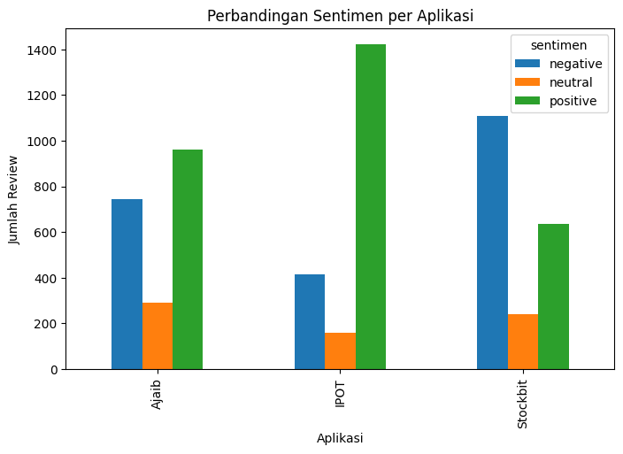
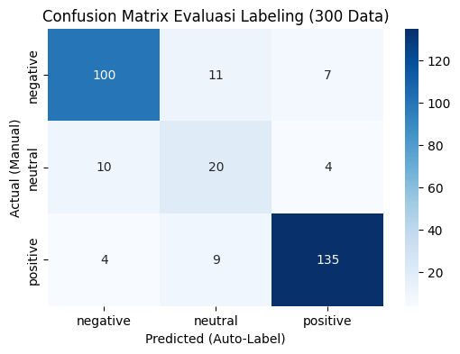
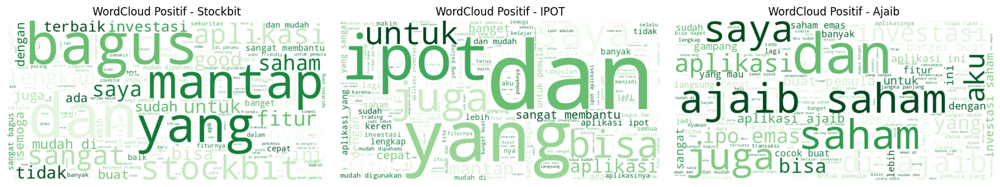
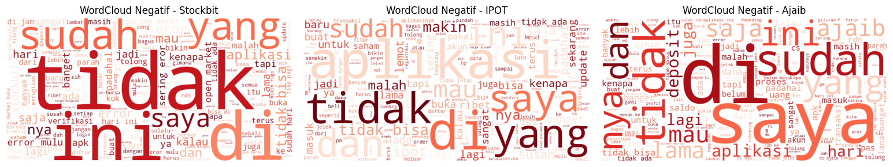
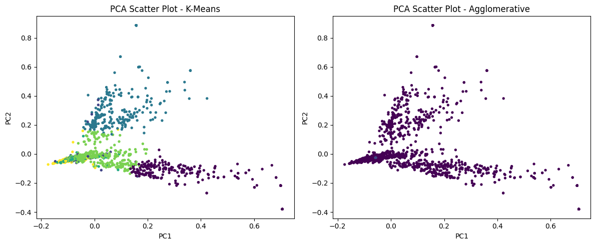
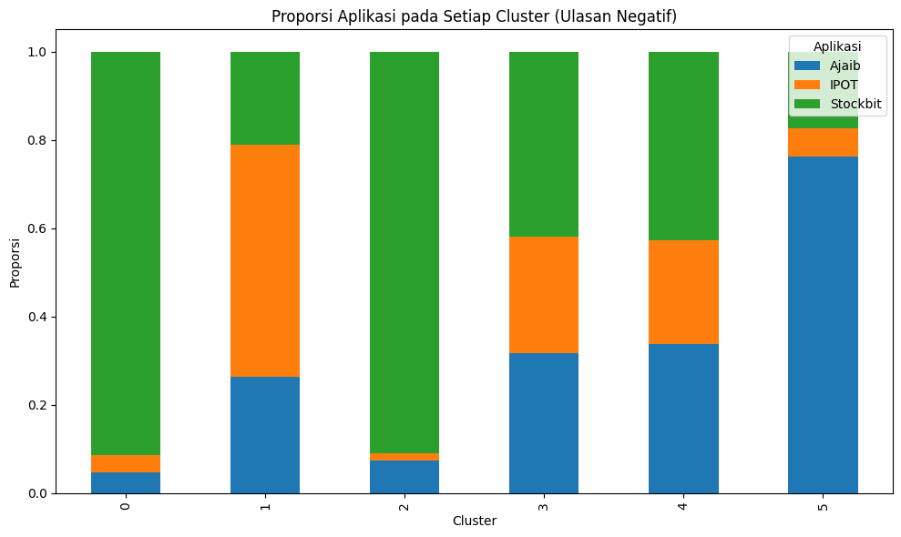

<div align="center">


<br/><br/>

# Broker App Sentiment Analysis
### Analisis & Perbandingan Sentimen Pengguna Aplikasi Sekuritas Ritel Indonesia

**Ajaib &nbsp;·&nbsp; IPOT &nbsp;·&nbsp; Stockbit** — via Google Play Store Reviews

<br/>

> *Proyek ini bersifat akademik untuk keperluan mata kuliah Pemrosesan Teks — bukan rekomendasi investasi.*

<br/>


</div>

---

## Overview

Aplikasi sekuritas ritel seperti **Ajaib**, **IPOT**, dan **Stockbit** memiliki jutaan pengguna aktif, namun persepsi pengguna terhadap kualitas layanan belum banyak dikaji secara sistematis. Proyek ini membangun pipeline lengkap dari **scraping hingga topic clustering** untuk menjawab:

- Bagaimana distribusi sentimen pengguna pada masing-masing aplikasi?
- Apa saja tema keluhan utama yang paling sering muncul?
- Aplikasi mana yang paling stabil berdasarkan ulasan pengguna?

---

## Pipeline

```
Google Play Scraping 2.000 ulasan × 3 aplikasi = 6.000 total
↓
Text Preprocessing Lower Case → Remove HTML → Remove Punctuation
→ Remove Emoji → Normalisasi Kata Non-Baku
↓
Sentiment Classification IndoRoBERTa (w11wo/indonesian-roberta-base-sentiment-classifier)
↓
Evaluation 300 label manual → Confusion Matrix · Accuracy · F1-Score
↓
Topic Clustering TF-IDF → K-Means (k=6) vs Agglomerative → PCA Visualization
↓
Analisis Tema Keluhan Per aplikasi berdasarkan top words cluster
```

---

## Repository Structure

```
BrokerAppSentiment/

notebook/
broker_sentiment.ipynb # Full pipeline dalam satu notebook

data/
01_reviews_all_sekuritas_raw.csv # Raw scraping hasil
02_reviews_data_normalized.csv # Setelah preprocessing
03_reviews_data_SentimenLabelling.csv # Setelah auto-labelling
04_evaluasi_300_data.csv # 300 data untuk evaluasi manual
05_reviews_data_SentimenNegative.csv # Filter ulasan negatif

assets/ # Visualisasi hasil analisis
sentiment_distribution.png
sentiment_piechart_negative.png
wordcloud_positive.png
wordcloud_negative.png
confusion_matrix.png
elbow_kmeans.png
pca_scatter.png
cluster_proportion.png

README.md
requirements.txt
```

---

## Key Results

### Distribusi Sentimen per Aplikasi

| Aplikasi | Negatif | Netral | Positif |
|:--------:|:---------:|:--------:|:---------:|
| Ajaib | 743 | 291 | 962 |
| IPOT | 414 | 157 | 1.421 |
| Stockbit | 1.109 | 242 | 637 |



> **IPOT** → ulasan positif tertinggi (71%) — aplikasi paling stabil 
> **Stockbit** → ulasan negatif terbanyak (49%) — banyak keluhan error & login 
> **Ajaib** → sentimen seimbang (32,8% negatif) — apresiasi dan keluhan muncul bersamaan

---

### Evaluasi Model IndoRoBERTa



Model dievaluasi pada **300 label manual**. Performa terbaik pada kelas positif & negatif; kelas netral lebih sulit karena ulasan ambigu (ulasan singkat, kata positif dalam konteks keluhan).

---

### WordCloud Sentimen




---

### Topic Clustering — K-Means (k=6)



| # | Tema | Cluster | Top Words |
|---|------|:-------:|-----------|
| 1 | Gangguan Sistem saat Open Market | 0 & 2 | error, eror, market, jam, open, pagi |
| 2 | Performa & Dampak Update | 1 | lemot, parah, update, aplikasi |
| 3 | Kendala Verifikasi & Akses Akun | 3 | verifikasi, akun, susah, login, daftar |
| 4 | Kompleksitas Penggunaan Aplikasi | 4 | ribet, buka, saham, update |



---

## How to Run

```bash
# 1. Clone repo
git clone https://github.com/rafikingakbar/BrokerAppSentiment.git
cd BrokerAppSentiment

# 2. Install dependencies
pip install -r requirements.txt

# 3. Buka notebook
jupyter notebook notebook/broker_sentiment.ipynb
```

> Data sudah tersedia di folder `data/` — bagian scraping bisa dilewati, langsung mulai dari **Preprocessing**.

---

## Tech Stack

| Kategori | Library |
|----------|---------|
| Scraping | `google-play-scraper` |
| NLP & Preprocessing | `transformers`, `nltk`, `demoji` |
| Machine Learning | `scikit-learn` (TF-IDF, K-Means, Agglomerative, PCA) |
| Visualization | `matplotlib`, `seaborn`, `wordcloud` |
| Pretrained Model | [`w11wo/indonesian-roberta-base-sentiment-classifier`](https://huggingface.co/w11wo/indonesian-roberta-base-sentiment-classifier) |

---

**Author:** Rafi King Akbar